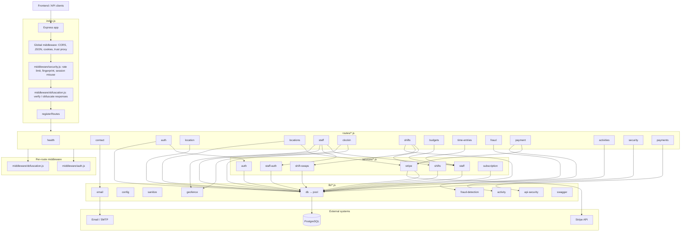

# Backend component diagram

Express entrypoint, global middleware, route modules, services, libraries, and external systems.

```mermaid
flowchart TB
  subgraph External["External systems"]
    PG[(PostgreSQL)]
    Stripe[Stripe API]
    SMTP[Email / SMTP]
  end

  subgraph Entry["index.js"]
    Express[Express app]
    MW_Global["Global middleware: CORS, JSON, cookies, trust proxy"]
    MW_Sec["middleware/security.js: rate limit, fingerprint, session misuse"]
    MW_Obf["middleware/obfuscation.js: verify / obfuscate responses"]
    RegRoutes[registerRoutes]
  end

  subgraph RouteMW["Per-route middleware"]
    AuthMW[middleware/auth.js]
    ObfMW[middleware/obfuscation.js]
  end

  subgraph Routes["routes/*.js"]
    R_Health[health]
    R_Contact[contact]
    R_Auth[auth]
    R_Loc[location]
    R_Locs[locations]
    R_Staff[staff]
    R_Clock[clockin]
    R_Shifts[shifts]
    R_Budget[budgets]
    R_Time[time-entries]
    R_Fraud[fraud]
    R_Pay[payment]
    R_Act[activities]
    R_Sec[security]
    R_Pays[payments]
  end

  subgraph Services["services/*.js"]
    S_Auth[auth]
    S_Staff[staff]
    S_StaffAuth[staff-auth]
    S_Shifts[shifts]
    S_Swap[shift-swaps]
    S_Stripe[stripe]
    S_Sub[subscription]
  end

  subgraph Lib["lib/*.js"]
    L_DB[db → pool]
    L_Config[config]
    L_Sanitize[sanitize]
    L_Email[email]
    L_Act[activity]
    L_Geo[geofence]
    L_Fraud[fraud-detection]
    L_APISec[api-security]
    L_Swagger[swagger]
  end

  FE[Frontend / API clients] --> Express
  Express --> MW_Global --> MW_Sec --> MW_Obf --> RegRoutes
  RegRoutes --> Routes
  Routes --> AuthMW
  Routes --> ObfMW

  R_Auth --> S_Auth
  R_Staff --> S_Staff
  R_Staff --> S_StaffAuth
  R_Shifts --> S_Shifts
  R_Shifts --> S_Swap
  R_Time --> S_Staff
  R_Budget --> S_Staff
  R_Locs --> S_Stripe
  R_Pay --> S_Stripe
  R_Contact --> L_Email
  R_Act --> L_Act
  R_Sec --> L_APISec
  R_Fraud --> L_Fraud

  R_Shifts --> L_DB
  R_Auth --> L_DB
  R_Staff --> L_DB
  R_Clock --> L_DB
  R_Clock --> L_Geo
  R_Staff --> L_Geo
  R_Pay --> L_DB
  R_Pays --> L_DB
  R_Loc --> L_DB
  R_Locs --> L_DB

  S_Auth --> L_DB
  S_Staff --> L_DB
  S_StaffAuth --> L_DB
  S_Shifts --> L_DB
  S_Swap --> L_DB
  S_Stripe --> L_DB
  S_Sub --> L_DB

  S_Stripe --> Stripe
  L_Email --> SMTP
  L_DB --> PG
```
