# Database schema (1:1 with `database-schema/` + migrations)

**Sources**

| Artifact | Role |
|----------|------|
| `database-schema/*.sql` | Base `CREATE TABLE`, constraints, indexes, triggers |
| `database-schema/add-users.sql` | Extra `users` columns |
| `database-schema/add-time-entries.sql` | Extra `time_entries` columns/constraints |

**Notes**

- Types follow PostgreSQL; `timestamptz` = `timestamp with time zone`, `timestamp` = `timestamp without time zone` where used in dumps.
- `activity_feed.user_id` is `integer` in the dump but FK targets `users(id)` (`bigint`); PostgreSQL accepts the cast.
- `api_keys.user_id`, `request_signing_keys.user_id`, `security_audit_logs.user_id`, `ip_whitelists.user_id` use `integer` in dump vs `bigint` on `users.id` (FK still defined).
- `fraud_flags.resolved_by` → `users(id)` has no `ON DELETE` clause in the dump (default `NO ACTION`).
- `rate_limit_logs` has **no foreign keys**.

---

## Entity–relationship diagram (Mermaid)

```mermaid
erDiagram
  users {
    bigint id PK
    text email UK
    text password_hash
    text name
    boolean is_verified
    timestamptz created_at
    timestamptz updated_at
    text subscription_status
    text subscription_plan
    timestamptz subscription_start_date
    timestamptz subscription_end_date
    text payment_method
    timestamptz last_payment_date
    text stripe_customer_id
    text stripe_subscription_id
    numeric latitude
    numeric longitude
    int subscription_staff_limit
    int location_radius
    text totp_secret
    boolean totp_enabled
    boolean email_2fa_enabled
    boolean is_admin
    int subscription_discount_percent
  }

  sessions {
    uuid id PK
    bigint user_id FK
    timestamptz expires_at
    timestamptz created_at
    text ip_address
    text user_agent
  }

  staff {
    bigint id PK
    bigint user_id FK
    text name
    text email
    text role
    numeric hourly_rate
    text employment_type
    text status
    timestamptz created_at
    timestamptz updated_at
    int suspicious_pattern_count
    timestamptz last_pattern_check
    text username UK
    text password_hash
    boolean password_set
    varchar clockin_id UK
  }

  shifts {
    bigint id PK
    bigint user_id FK
    bigint staff_id FK
    date shift_date
    time start_time
    numeric hours
    int break_minutes
    text shift_type
    text status
    text location
    text notes
    timestamptz created_at
    timestamptz updated_at
    timestamptz approved_at
    bigint approved_by FK
    bigint time_entry_id FK
    timestamp clocked_in_time
    timestamp clocked_out_time
    varchar pay_type
  }

  time_entries {
    bigint id PK
    bigint staff_id FK
    bigint user_id FK
    date date
    numeric hours_worked
    numeric overtime_hours
    text notes
    timestamptz created_at
    timestamptz updated_at
    text entry_type
    timestamptz clock_in_time
    timestamptz clock_out_time
    timestamptz last_activity_time
    int edit_count
    boolean is_edited
    bigint shift_id FK
    timestamptz approved_at
    bigint approved_by FK
  }

  budgets {
    bigint id PK
    bigint user_id FK
    text name
    numeric monthly_budget
    date start_date
    date end_date
    text status
    timestamptz created_at
    timestamptz updated_at
  }

  activity_feed {
    int id PK
    int user_id FK
    varchar activity_type
    varchar activity_title
    text activity_description
    int staff_id FK
    int shift_id FK
    varchar icon
    varchar color
    timestamp created_at
  }

  api_keys {
    uuid id PK
    int user_id FK
    varchar key_name
    varchar api_key_hash UK
    varchar api_key_prefix
    boolean is_active
    timestamp last_used_at
    timestamp expires_at
    text allowed_ips
    text allowed_endpoints
    int rate_limit_per_minute
    int rate_limit_per_hour
    timestamp created_at
    timestamp updated_at
  }

  device_links {
    uuid id PK
    bigint user_id FK
    bigint staff_id FK
    varchar link_token UK
    text device_fingerprint
    text device_name
    timestamptz created_at
    timestamptz expires_at
    boolean is_active
    timestamptz last_used_at
  }

  fraud_flags {
    bigint id PK
    bigint user_id FK
    bigint staff_id FK
    bigint time_entry_id FK
    text flag_type
    text severity
    text description
    boolean is_resolved
    bigint resolved_by FK
    timestamptz resolved_at
    text resolution_notes
    timestamptz created_at
  }

  payroll_records {
    bigint id PK
    bigint user_id FK
    date period_start
    date period_end
    numeric total_amount
    numeric total_hours
    text status
    text notes
    timestamptz created_at
    timestamptz updated_at
  }

  payroll_line_items {
    bigint id PK
    bigint payroll_record_id FK
    bigint staff_id FK
    numeric regular_hours
    numeric overtime_hours
    numeric hourly_rate
    numeric regular_pay
    numeric overtime_pay
    numeric total_pay
    timestamptz created_at
  }

  shift_swaps {
    bigint id PK
    bigint shift_id FK
    bigint requester_staff_id FK
    bigint target_staff_id FK
    text status
    text message
    timestamptz created_at
    timestamptz updated_at
  }

  shift_swap_requests {
    bigint id PK
    bigint requester_shift_id FK
    bigint requested_shift_id FK
    bigint requester_staff_id FK
    bigint requested_staff_id FK
    varchar status
    text message
    timestamptz created_at
    timestamptz updated_at
    timestamptz resolved_at
  }

  staff_sessions {
    uuid id PK
    bigint staff_id FK
    timestamptz expires_at
    timestamptz created_at
    text ip_address
    text user_agent
  }

  staff_password_tokens {
    bigint id PK
    bigint staff_id FK
    text token UK
    timestamptz expires_at
    timestamptz used_at
    timestamptz created_at
  }

  password_reset_tokens {
    bigint id PK
    bigint user_id FK
    varchar token UK
    text email
    timestamptz expires_at
    timestamptz used_at
    timestamptz created_at
  }

  login_codes {
    bigint id PK
    bigint user_id FK
    varchar code
    text email
    timestamptz expires_at
    timestamptz used_at
    timestamptz created_at
  }

  rate_limit_logs {
    uuid id PK
    varchar identifier
    varchar endpoint
    int request_count
    timestamp window_start
    varchar window_type
    timestamp created_at
  }

  request_signing_keys {
    uuid id PK
    int user_id FK
    varchar key_name
    varchar signing_key_hash UK
    varchar signing_key_prefix
    boolean is_active
    timestamp last_used_at
    timestamp expires_at
    timestamp created_at
  }

  security_audit_logs {
    uuid id PK
    int user_id FK
    varchar event_type
    varchar ip_address
    text user_agent
    varchar endpoint
    varchar request_method
    jsonb details
    varchar severity
    timestamp created_at
  }

  ip_whitelists {
    uuid id PK
    int user_id FK
    varchar ip_address
    varchar cidr_block
    text description
    boolean is_active
    timestamp created_at
  }

  users ||--o{ sessions : "sessions.user_id"
  users ||--o{ staff : "staff.user_id"
  users ||--o{ shifts : "shifts.user_id"
  users ||--o{ shifts : "shifts.approved_by"
  users ||--o{ time_entries : "time_entries.user_id"
  users ||--o{ time_entries : "time_entries.approved_by"
  users ||--o{ budgets : "budgets.user_id"
  users ||--o{ activity_feed : "activity_feed.user_id"
  users ||--o{ api_keys : "api_keys.user_id"
  users ||--o{ device_links : "device_links.user_id"
  users ||--o{ fraud_flags : "fraud_flags.user_id"
  users ||--o{ fraud_flags : "fraud_flags.resolved_by"
  users ||--o{ payroll_records : "payroll_records.user_id"
  users ||--o{ password_reset_tokens : "password_reset_tokens.user_id"
  users ||--o{ login_codes : "login_codes.user_id"
  users ||--o{ request_signing_keys : "request_signing_keys.user_id"
  users ||--o{ security_audit_logs : "security_audit_logs.user_id"
  users ||--o{ ip_whitelists : "ip_whitelists.user_id"

  staff ||--o{ shifts : "shifts.staff_id"
  staff ||--o{ time_entries : "time_entries.staff_id"
  staff ||--o{ activity_feed : "activity_feed.staff_id"
  staff ||--o{ device_links : "device_links.staff_id"
  staff ||--o{ fraud_flags : "fraud_flags.staff_id"
  staff ||--o{ payroll_line_items : "payroll_line_items.staff_id"
  staff ||--o{ shift_swaps : "shift_swaps.requester_staff_id"
  staff ||--o{ shift_swaps : "shift_swaps.target_staff_id"
  staff ||--o{ shift_swap_requests : "shift_swap_requests.requester_staff_id"
  staff ||--o{ shift_swap_requests : "shift_swap_requests.requested_staff_id"
  staff ||--o{ staff_sessions : "staff_sessions.staff_id"
  staff ||--o{ staff_password_tokens : "staff_password_tokens.staff_id"

  shifts ||--o{ time_entries : "time_entries.shift_id"
  shifts ||--o{ activity_feed : "activity_feed.shift_id"
  shifts ||--o{ shift_swaps : "shift_swaps.shift_id"
  shifts ||--o{ shift_swap_requests : "shift_swap_requests.requester_shift_id"
  shifts ||--o{ shift_swap_requests : "shift_swap_requests.requested_shift_id"

  shifts }o--o| time_entries : "time_entry_id"
  time_entries ||--o{ fraud_flags : "fraud_flags.time_entry_id"

  payroll_records ||--o{ payroll_line_items : "payroll_line_items.payroll_record_id"
```

**Relationship summary (FK `ON DELETE` from SQL)**

| From | To | ON DELETE |
|------|-----|-----------|
| sessions | users | CASCADE |
| staff | users | CASCADE |
| shifts | users | CASCADE |
| shifts | users (approved_by) | SET NULL |
| shifts | staff | CASCADE |
| shifts | time_entries | SET NULL |
| time_entries | shifts | SET NULL |
| time_entries | staff | CASCADE |
| time_entries | users | CASCADE |
| time_entries | users (approved_by) | *(migration: REFERENCES users(id))* |
| budgets | users | CASCADE |
| activity_feed | users | CASCADE |
| activity_feed | staff | SET NULL |
| activity_feed | shifts | SET NULL |
| api_keys | users | CASCADE |
| device_links | users | CASCADE |
| device_links | staff | CASCADE |
| fraud_flags | users | CASCADE |
| fraud_flags | staff | CASCADE |
| fraud_flags | time_entries | CASCADE |
| fraud_flags | users (resolved_by) | *(not specified)* |
| payroll_records | users | CASCADE |
| payroll_line_items | payroll_records | CASCADE |
| payroll_line_items | staff | CASCADE |
| shift_swaps | shifts | CASCADE |
| shift_swaps | staff (requester) | CASCADE |
| shift_swaps | staff (target) | SET NULL |
| shift_swap_requests | shifts (both) | CASCADE |
| shift_swap_requests | staff (both) | CASCADE |
| staff_sessions | staff | CASCADE |
| staff_password_tokens | staff | CASCADE |
| password_reset_tokens | users | CASCADE |
| login_codes | users | CASCADE |
| request_signing_keys | users | CASCADE |
| security_audit_logs | users | SET NULL |
| ip_whitelists | users | CASCADE |

---

## Files not modeled as tables

- `database-schema/00_functions_and_triggers.sql` — functions (`update_updated_at_column`, `increment_edit_count`, etc.) and shared triggers; already referenced by table dumps.
- Index definitions, `CHECK` constraints, and trigger attachments are in the per-table `.sql` files above.
