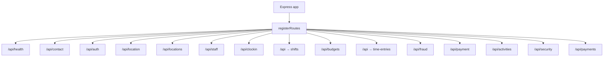

# Route registration (package view)

`registerRoutes(app)` in `routes/index.js` — mount paths.

Note: `shifts` and `time-entries` both mount on `/api`; their routers define paths like `/shifts`, `/time-entries`, etc. See each `routes/*.js` file for exact HTTP paths.
